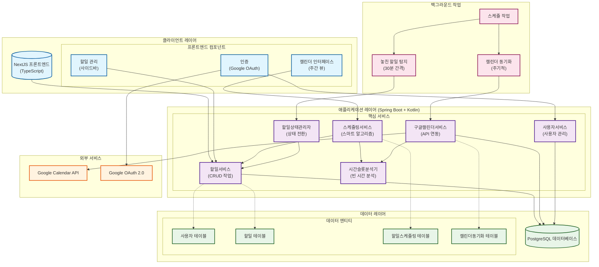
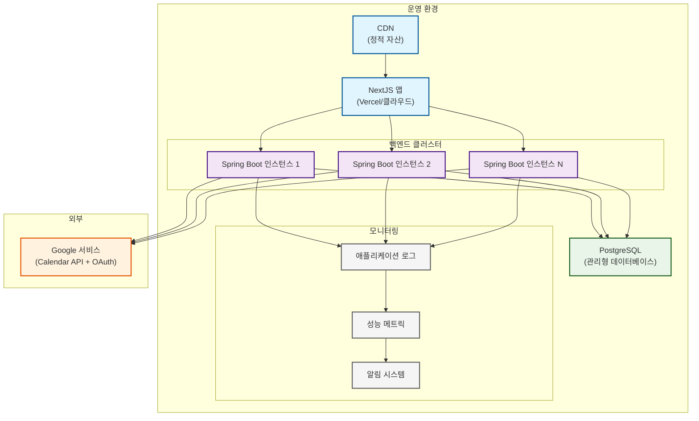

# Todo Time-blocking 앱 - 시스템 아키텍처

## 개요
이 문서는 Google Calendar와 연동하여 할 일을 자동으로 스케줄링하는 Todo Time-blocking 웹 애플리케이션의 시스템 아키텍처를 설명합니다.

## 기술 스택
- **프론트엔드**: NextJS + TypeScript
- **백엔드**: Spring Boot + Kotlin  
- **데이터베이스**: PostgreSQL
- **외부 연동**: Google Calendar API
- **인증**: Google OAuth 2.0
- **통신**: REST API (WebSocket/SSE 사용 안함)

## 시스템 아키텍처 다이어그램



## 아키텍처 컴포넌트

### 클라이언트 레이어 (NextJS + TypeScript)
- **캘린더 인터페이스**: 드래그앤드롭 기능이 있는 주간 캘린더 뷰
- **할일 관리**: 할일 목록, 필터링, CRUD 작업이 있는 사이드바  
- **인증**: 안전한 로그인을 위한 Google OAuth 연동

### 애플리케이션 레이어 (Spring Boot + Kotlin)
- **할일서비스**: 할일 CRUD 작업 및 생명주기 관리
- **스케줄링서비스**: 스마트 스케줄링 알고리즘 구현
- **구글캘린더서비스**: Google Calendar API 연동 처리
- **시간슬롯분석기**: 사용 가능한 시간 슬롯 및 충돌 분석
- **사용자서비스**: 사용자 프로필 및 환경설정 관리
- **할일상태관리자**: 할일 상태 전환 및 놓친 할일 감지 처리

### 백그라운드 작업
- **놓친 할일 탐지**: 30분마다 실행하여 기한이 지난 할일 식별
- **캘린더 동기화**: Google Calendar와 주기적 동기화

### 데이터 레이어 (PostgreSQL)
- **사용자**: 사용자 프로필 및 Google 계정 연동 정보
- **할일**: 제목, 소요시간, 카테고리, 상태 등 메타데이터를 포함한 할일 항목
- **할일스케줄링**: 예약된 시간 슬롯 및 분할된 할일 관계 정보
- **캘린더동기화**: Google Calendar 동기화 메타데이터

### 외부 서비스
- **Google Calendar API**: 캘린더 데이터 연동
- **Google OAuth 2.0**: 인증 및 권한 부여

## 주요 데이터 플로우

### 1. 할일 생성 & 자동 스케줄링
```
프론트엔드 → POST /api/v1/todos → 할일서비스 → 데이터베이스
프론트엔드 → POST /api/v1/scheduling/auto-schedule → 스케줄링서비스
스케줄링서비스 → 구글캘린더서비스 → 시간슬롯분석기 → 데이터베이스
```

### 2. 캘린더 동기화  
```
백그라운드 작업 → 구글캘린더서비스 → Google Calendar API
Google Calendar API → 데이터베이스 업데이트 → 할일상태관리자
```

### 3. 놓친 할일 탐지
```
스케줄 작업 → 할일상태관리자 → 데이터베이스 쿼리
상태 업데이트 → 우선순위 부스트 → 다음 자동 스케줄링
```

## 품질 특성

- **확장성**: 상태 없는 백엔드 서비스로 수평 확장 가능
- **신뢰성**: 데이터베이스 트랜잭션으로 데이터 일관성 보장
- **보안**: OAuth 2.0 인증과 안전한 API 엔드포인트
- **성능**: 백그라운드 작업으로 무거운 연산 처리
- **유지보수성**: 깔끔한 서비스 분리 및 의존성 주입
- **연동성**: Google Calendar와 원활한 양방향 동기화

## 배포 아키텍처

